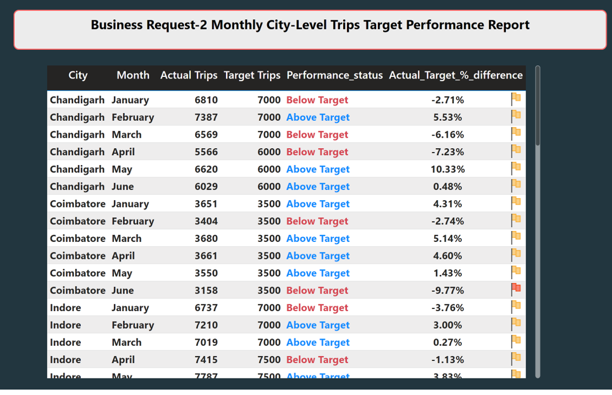

# Good Cabs Revenue Analysis - PowerBI & SQL
Provide Insights to Chief of Operations in Transportation Domain
### Project Description:
Goodcabs, a cab service company established two years ago, has gained a strong foothold in the Indian market by focusing on tier-2 cities. Unlike other cab service providers, Goodcabs is committed to supporting local drivers, helping them make a sustainable living in their hometowns while ensuring excellent service to passengers. With operations in ten tier-2 cities across India, Goodcabs has set ambitious performance targets for 2024 to drive growth and improve passenger satisfaction.

As part of this initiative, the Goodcabs management team aims to assess the company’s performance across key metrics, including trip volume, passenger satisfaction, repeat passenger rate, trip distribution, and the balance between new and repeat passengers

### Data:
We have trip data for 6 months (January to June) of 10 Indian cities during the year 2024.

### Data Model

## PowerBI Dashboard:

 ### Home Page

 ### Data view

### City Analysis

### Passenger Trends

### Trip Analysis
 

## Business Request:

 

## Primary Analysis:

## Key Insights:

 - Cities **Jaipur, Kochi,** and **Chandigarh** generated the most revenue, with **Jaipur** leading (37.21Million).
 - Months **February** and **March** show highest trip volume, with **February** leading (75000 trips).
 - Repeat Passengers are high in **Surat(42.6%)** and **Lucknow (37.1%)**, but low in **Jaipur (11.2%)**.
 - New Passengers are Highest in **Jan-Feb**, declining in **May-June**.
 - Passenger ratings are high in **Jaipur, Kochi, Mysore**. Low in **Lucknow, Surat and Vadodara**.
 - Tourism Cities (Jaipur, Kochi): Higher trip volume on weekends.
 - **Business Cities** met passenger target, but missed trip volume and passenger ratings targets.
 - **Tourism Cities** met trip targets, but passenger ratings were below target.

 ## Recommendations:

 1. Loyalty Programs: 
  - Introduce rewards for frequent users to encourage repeat trips.
 2. City-Specific Offers: 
 - Adjust pricing strategies in high-fare cities to encourage regular usage.
3. Improve Service Quality
- Address customer complaints and improve driver behaviour
4. Dynamic pricing strategy
- Optimize fair based on demand, city and competitor
5. Expand EV fleet
- Introduce eco-friendly initiatives like electric cabs and solar charging stations. 
6. Leverage Seasonal Trends
- Promotions around peak months and weekend 

